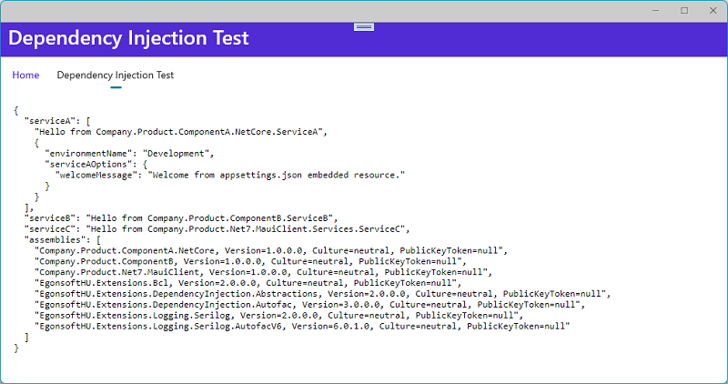
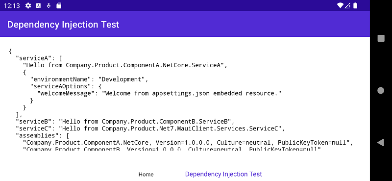

# Egonsoft.HU DependencyInjection Extensions for Autofac

[](https://opensource.org/licenses/MIT)
[](https://www.nuget.org/packages/EgonsoftHU.Extensions.DependencyInjection.Autofac)
[](https://www.nuget.org/packages/EgonsoftHU.Extensions.DependencyInjection.Autofac)

A dependency module (derived from Autofac.Module) that discovers and registers all other dependency modules (derived from Autofac.Module).

The dependency modules can also have shared dependencies injected into them, e.g. `IConfiguration`, `IHostEnvironment` and even `IServiceCollection`, see [Module Dependencies - injection into modules](#module-dependencies---injection-into-modules) for details.

**Please note:** `EgonsoftHU.Extensions.DependencyInjection.Abstractions` project moved to [its own repository](https://github.com/gcsizmadia/EgonsoftHU.Extensions.DependencyInjection.Abstractions).

## Table of Contents

- [Introduction](#introduction)
- [Releases](#releases)
- [Autofac version](#autofac-version)
- [Summary](#summary)
- [Instructions](#instructions)
  - [Instructions for .NET Core 3.1 / .NET 5 / .NET 6](#instructions-for-net-core-31--net-5--net-6)
  - [Instructions for .NET Framework 4.6.1+](#instructions-for-net-framework-461)
  - [Usage option #1 - Use the default assembly registry](#usage-option-1---use-the-default-assembly-registry)
  - [Usage option #2 - Use your custom assembly registry (interface + parameterless ctor)](#usage-option-2---use-your-custom-assembly-registry-interface--parameterless-ctor)
  - [Usage option #3 - Use your custom assembly registry (interface only)](#usage-option-3---use-your-custom-assembly-registry-interface-only)
  - [Usage option #4 - Use your custom assembly registry (it will be used through reflection)](#usage-option-4---use-your-custom-assembly-registry-it-will-be-used-through-reflection)
- [Module Dependencies - injection into modules](#module-dependencies---injection-into-modules)
- [Examples](#examples)
  - [Example output](#example-output)

## Introduction

The motivation behind this project is to automatically discover and register all dependency modules in projects that are referenced by the startup project and also being able to use `IConfiguration`, `IHostEnvironment` and even `IServiceCollection` instances as well.

## Releases

You can download the package from [nuget.org](https://www.nuget.org/).
- [EgonsoftHU.Extensions.DependencyInjection.Autofac](https://www.nuget.org/packages/EgonsoftHU.Extensions.DependencyInjection.Autofac)

You can find the release notes [here](https://github.com/gcsizmadia/EgonsoftHU.Extensions.DependencyInjection.Autofac/releases).

## Autofac version

|EgonsoftHU.Extensions.DependencyInjection.Autofac|1.0.0 - 2.0.0|3.0.0|
|:-|:-:|:-:|
|Autofac.Extensions.DependencyInjection<br/>*dependency type:*|-|8.0.0<br/>*direct / top-level*|
|Autofac<br/>*dependency type:*|4.9.4<br/>*direct / top-level*|6.4.0<br/>*indirect / transitive*|
|Targeted .NET Framework|4.6.1+|4.7.2+|

**Note:** .NET Framework target version changed because `Autofac.WebApi2` that can be used with `Autofac` 6+ is targeted only to .NET Framework 4.7.2.

## Summary

To use this solution you need to do 2 things.

***First***, configure an assembly registry. There is a default implementation you can use.

The default implementation:
- requires your assembly file name prefixes, e.g. `YourPrefix`
- will search for assembly files with the following pattern: `YourPrefix.*.dll`

You can provide your own implementation. The required steps to implement:
- **Initialization (ensure all relevant assemblies are loaded into the `AppDomain`)**  
  *either* using the parameterless ctor  
  *or* any other way that happens before configuring your implementation as the assembly registry
- **Getting all assemblies**  
  *either* implement this interface: `EgonsoftHU.Extensions.DependencyInjection.IAssemblyRegistry`  
  *or* provide a public parameterless instance method that can be called using reflection.  
     e.g. `public IEnumerable<Assembly> GetAssemblies()`  
     **Note:**
     The method name must be `GetAssemblies`.
     The return type can be any type that can be assigned to a variable of the `IEnumerable<Assembly>` type.

***Finally***, register the module that will discover and register all other modules.

## Instructions

The usage options are the same for both .NET Framework and .NET Core 3.1 / .NET 5 / .NET 6.
The difference is where the magic happens.

### Instructions for .NET Core 3.1 / .NET 5 / .NET 6

***First***, install the *EgonsoftHU.Extensions.DependencyInjection.Autofac* [NuGet package](https://www.nuget.org/packages/EgonsoftHU.Extensions.DependencyInjection.Autofac).
```
dotnet add package EgonsoftHU.Extensions.DependencyInjection.Autofac
```

***Next***, add `ConfigureContainer<ContainerBuilder>()` to the Generic Host in `CreateHostBuilder()`.
```C#
using Autofac;
using Autofac.Extensions.DependencyInjection;

using EgonsoftHU.Extensions.DependencyInjection;

namespace YourCompany.YourProduct.WebApi
{
    public class Program
    {
        // rest omitted for clarity

        static IHostBuilder CreateHostBuilder(string[] args)
        {
            return
                Host.CreateDefaultBuilder(args)
                    .ConfigureWebHostDefaults(
                        webHostBuilder =>
                        {
                            webHostBuilder.UseStartup<Startup>();
                        }
                    )
                    .UseServiceProviderFactory(new AutofacServiceProviderFactory())
                    .ConfigureContainer<ContainerBuilder>( // <-- Add this method call
                        builder =>
                        {
                            // here comes the magic
                        }
                    );
        }
    }
}
```

***Alternatively***, you can add `ConfigureContainer(ContainerBuilder builder)` to your `Startup.cs` file.

```C#
using Autofac;

using EgonsoftHU.Extensions.DependencyInjection;

namespace YourCompany.YourProduct.WebApi
{
    public class Startup
    {
        // rest omitted for clarity.

        public void ConfigureContainer(ContainerBuilder builder) // <-- Add this method
        {
            // here comes the magic
        }
    }
}
```

***Finally***, replace the `// here comes the magic` comment with one of the usage options.

### Instructions for .NET Framework 4.6.1+

***First***, in the Package Manager Console install the *EgonsoftHU.Extensions.DependencyInjection.Autofac* [NuGet package](https://www.nuget.org/packages/EgonsoftHU.Extensions.DependencyInjection.Autofac).
```pwsh
Install-Package EgonsoftHU.Extensions.DependencyInjection.Autofac
```

***Then***, locate where you create Autofac's `ContainerBuilder`.

***Then***, choose one of the usage options below.

***Finally***, add the required code right after the creation of `ContainerBuilder`.

**Note:** You can find an example in the `Company.Product.NetFx.WebApi` project.
Check out the [`WebApiConfig.Extensions.Autofac.cs`](examples/Company.Product.NetFx.WebApi/App_Start/WebApiConfig.Extensions.Autofac.cs) file.
It contains configuring Autofac as the ASP.NET dependency resolver and also the [usage option #1](#usage-option--1---use-the-default-assembly-registry).

### Usage option #1 - Use the default assembly registry

```C#
/*
 * Step #1: Configure assembly registry
 *
 * Use the default assembly registry.
 * Provide your assembly file name prefixes.
 */

// if the DefaultAssemblyRegistry is not initialized yet
builder.UseDefaultAssemblyRegistry(nameof(YourCompany));

// if you already initialized the DefaultAssemblyRegistry by calling its Initialize() method
builder.UseAssemblyRegistry(DefaultAssemblyRegistry.Current);

// Step #2: Register the module that will discover and register all other modules.
builder.RegisterModule<EgonsoftHU.Extensions.DependencyInjection.DependencyModule>();
```

### Usage option #2 - Use your custom assembly registry (interface + parameterless ctor)

```C#
/*
 * Step #1: Configure assembly registry
 *
 * The custom assembly registry must:
 * - implement this interface: EgonsoftHU.Extensions.DependencyInjection.IAssemblyRegistry
 * - have a parameterless ctor that initializes the instance
 */
builder.UseAssemblyRegistry<YourCustomAssemblyRegistry>();

// Step #2: Register the module that will discover and register all other modules.
builder.RegisterModule<EgonsoftHU.Extensions.DependencyInjection.DependencyModule>();
```

### Usage option #3 - Use your custom assembly registry (interface only)

```C#
/*
 * Step #1: Configure assembly registry
 *
 * The custom assembly registry must:
 * - implement this interface: EgonsoftHU.Extensions.DependencyInjection.IAssemblyRegistry
 */
IAssemblyRegistry assemblyRegistry = /* get an initialized instance of YourCustomAssemblyRegistry */
builder.UseAssemblyRegistry(assemblyRegistry);

// Step #2: Register the module that will discover and register all other modules.
builder.RegisterModule<EgonsoftHU.Extensions.DependencyInjection.DependencyModule>();
```

### Usage option #4 - Use your custom assembly registry (it will be used through reflection)

```C#
/*
 * Step #1: Configure assembly registry
 *
 * The custom assembly registry must provide a public parameterless instance method:
 * - Name: GetAssemblies
 * - Return type: assignable to IEnumerable<Assembly>
 */
object assemblyRegistry = /* get an initialized instance of YourCustomAssemblyRegistry */
builder.UseAssemblyRegistry(assemblyRegistry);

// Step #2: Register the module that will discover and register all other modules.
builder.RegisterModule<EgonsoftHU.Extensions.DependencyInjection.DependencyModule>();
```

## Module Dependencies - injection into modules

If you need to access some external information (e.g. `IConfiguration`) inside a module for registering a service then you can inject it.

Additionally, if you would like to use `IServiceCollection` extension methods inside your module then you can also inject an instance of it.

**Note:**
- Always create a new `IServiceCollection` instance for injection.
- Do NOT inject the already existing instance from your `IHostBuilder`/`WebApplicationBuilder`/etc.

Let's see the following example:

```csharp
using EgonsoftHU.Extensions.DependencyInjection;

builder
    .Host
    .UseServiceProviderFactory(new AutofacServiceProviderFactory())
    .ConfigureContainer<ContainerBuilder>(
        (hostBuilderContext, containerBuilder) =>
        {
            // This will be a shared instance for all modules.
            //
            // Always register a new instance because by the time the modules are executed
            // the service registration in builder.Services are already populated into the containerBuilder.
            IServiceCollection services = new ServiceCollection();

            containerBuilder
                .UseDefaultAssemblyRegistry(nameof(Company))
                .TreatModulesAsServices()
                .RegisterModuleDependencyInstance(services)
                .RegisterModuleDependencyInstance(hostBuilderContext.Configuration)
                .RegisterModuleDependencyInstance(hostBuilderContext.HostingEnvironment)
                .RegisterModule<EgonsoftHU.Extensions.DependencyInjection.DependencyModule>();
        }
    );
```

- `TreatModulesAsServices()`  
  - The dependency modules (derived from `Autofac.Module`) themselves as `Autofac.IModule` service type will be registered into a separate, temporary Autofac `ContainerBuilder` instance.
  - Each dependency module will be resolved from this container with their dependencies.
  - The resolved dependency module instance will then be registered using the main Autofac `ContainerBuilder` instance.
- `RegisterModuleDependencyInstance<T>(T instance)`
  - Registers an object instance as `T` service type into that seperate, temporary Autofac `ContainerBuilder` instance.

By default, the dependency module will get its dependencies through *property injection*.  
So your module has to have a public writable property with `T` type.

```csharp
using Autofac;

using EgonsoftHU.Extensions.Bcl;

using Microsoft.Extensions.Configuration;
using Microsoft.Extensions.DependencyInjection;
using Microsoft.Extensions.Hosting;

public class DependencyModule : Module
{
    public IConfiguration? Configuration { get; set; }

    public IServiceCollection? Services { get; set; }

    protected override void Load(ContainerBuilder builder)
    {
        // EgonsoftHU.Extensions.Bcl nuget package
        Configuration.ThrowIfNull();
        Services.ThrowIfNull();

        Services
            .AddOptions<MyCustomOptions>()
            // Microsoft.Extensions.Options.ConfigurationExtensions nuget package
            .Bind(Configuration.GetSection("MyCustomOptions"))
            // Microsoft.Extensions.Options.DataAnnotations nuget package
            .ValidateDataAnnotations()
            // Microsoft.Extensions.Hosting nuget package
            .ValidateOnStart();

        // Now you can register a service type that requires IOptions<MyCustomOptions>
        builder.RegisterType<CustomService>().As<ICustomService>().InstancePerLifetimeScope();
    }
}
```

You can also use *constructor injection*.

In this case instead of `TreatModulesAsServices()` extension method use `ConfigureModuleOptions()` extension method as below:

```csharp
containerBuilder
    .UseDefaultAssemblyRegistry(nameof(Company))
    .ConfigureModuleOptions(
        options =>
        {
            options.TreatModulesAsServices = true;
            options.DependencyInjectionOption = ModuleDependencyInjectionOption.ConstructorInjection;
        }
    )
    .RegisterModuleDependencyInstance(services)
    .RegisterModuleDependencyInstance(hostBuilderContext.Configuration)
    .RegisterModuleDependencyInstance(hostBuilderContext.HostingEnvironment)
    .RegisterModule<EgonsoftHU.Extensions.DependencyInjection.DependencyModule>();
```

**Please note:**

- Module dependency instances are registered this way:  
  `ContainerBuilder.RegisterInstance().ExternallyOwned()`
- You might register more instances of type `T` in which case set the type of the property (or the constructor parameter) to `IEnumerable<T>`.

## Examples

Check out [`Examples.sln`](Examples.sln) that references the following projects from the [`examples`](https://github.com/gcsizmadia/EgonsoftHU.Extensions.DependencyInjection.Autofac/tree/main/examples) folder:

|Type|Project&nbsp;Name&nbsp;/&nbsp;Target&nbsp;Framework|Description|
|:-:|-|-|
||`Company.Product.ComponentA.NetFx`<br/>.NET&nbsp;Framework&nbsp;4.7.2|Contains `ServiceA` and a `DependencyModule` that registers it.<br/><br/>`ConfigurationManager.AppSettings` is injected into `DependencyModule`.|
||`Company.Product.ComponentA.NetCore`<br/>.NET&nbsp;Core&nbsp;3.1|Contains `ServiceA` and a `DependencyModule` that registers it.<br/><br/>`IConfiguration` and `IHostEnvironment` are injected into `DependencyModule`.|
||`Company.Product.ComponentB`<br/>.NET&nbsp;Standard&nbsp;2.0|Contains `ServiceB` and a `DependencyModule` that registers it.|
||`Company.Product.NetFx.WebApi`<br/>.NET&nbsp;Framework&nbsp;4.7.2|Uses `ServiceA` and `ServiceB` and also contains and uses `ServiceC` and a `DependencyModule` that registers it.<br/><br/>`DefaultAssemblyRegistry` is configured to use `Serilog`.|
||`Company.Product.NetCore.WebApi`<br/>.NET&nbsp;Core&nbsp;3.1|Uses `ServiceA` and `ServiceB` and also contains and uses `ServiceC` and a `DependencyModule` that registers it.<br/><br/>`DefaultAssemblyRegistry` is configured to use `Microsoft.Extensions.Logging`.|
||`Company.Product.Net6.WebApi`<br/>.NET&nbsp;6.0|Uses `ServiceA` and `ServiceB` and also contains and uses `ServiceC` and a `DependencyModule` that registers it.<br/><br/>`DefaultAssemblyRegistry` is configured to use `Serilog`.|
||`Company.Product.Net7.MauiClient`<br/>.NET&nbsp;7.0|Uses `ServiceA` and `ServiceB` and also contains and uses `ServiceC` and a `DependencyModule` that registers it.<br/><br/>`DefaultAssemblyRegistry` is not configured to use any logging framework.|

### Example output

Navigating to the `~/api/tests` API endpoint should display this result:

*.NET Framework 4.7.2*

```json
{
  "ServiceA": [
    "Hello from Company.Product.ComponentA.NetFx.ServiceA",
    {
      "EnvironmentName": "Development",
      "WelcomeMessage": "Welcome from the Web.config file."
    }
  ],
  "ServiceB": "Hello from Company.Product.ComponentB.ServiceB",
  "ServiceC": "Hello from Company.Product.NetFx.WebApi.Services.ServiceC",
  "Assemblies": [
    "Company.Product.ComponentA.NetFx, Version=1.0.0.0, Culture=neutral, PublicKeyToken=null",
    "Company.Product.ComponentB, Version=1.0.0.0, Culture=neutral, PublicKeyToken=null",
    "Company.Product.NetFx.WebApi, Version=1.0.0.0, Culture=neutral, PublicKeyToken=null"
  ]
}
```

*.NET Core 3.1*

```json
{
  "serviceA": [
    "Hello from Company.Product.ComponentA.NetCore.ServiceA",
    {
      "environmentName": "Development",
      "serviceAOptions": {
        "welcomeMessage": "Welcome from the appsettings.Development.json file."
      }
    }
  ],
  "serviceB": "Hello from Company.Product.ComponentB.ServiceB",
  "serviceC": "Hello from Company.Product.NetCore.WebApi.Services.ServiceC",
  "assemblies": [
    "Company.Product.ComponentA.NetCore, Version=1.0.0.0, Culture=neutral, PublicKeyToken=null",
    "Company.Product.ComponentB, Version=1.0.0.0, Culture=neutral, PublicKeyToken=null",
    "Company.Product.NetCore.WebApi, Version=1.0.0.0, Culture=neutral, PublicKeyToken=null"
  ]
}
```

*.NET 6.0*

```json
{
  "serviceA": [
    "Hello from Company.Product.ComponentA.NetCore.ServiceA",
    {
      "environmentName": "Development",
      "serviceAOptions": {
        "welcomeMessage": "Welcome from the appsettings.Development.json file."
      }
    }
  ],
  "serviceB": "Hello from Company.Product.ComponentB.ServiceB",
  "serviceC": "Hello from Company.Product.Net6.WebApi.Services.ServiceC",
  "assemblies": [
    "Company.Product.ComponentA.NetCore, Version=1.0.0.0, Culture=neutral, PublicKeyToken=null",
    "Company.Product.ComponentB, Version=1.0.0.0, Culture=neutral, PublicKeyToken=null",
    "Company.Product.Net6.WebApi, Version=1.0.0.0, Culture=neutral, PublicKeyToken=null"
  ]
}
```

*.NET 7.0 + MAUI (Windows)*



*.NET 7.0 + MAUI (Android)*


